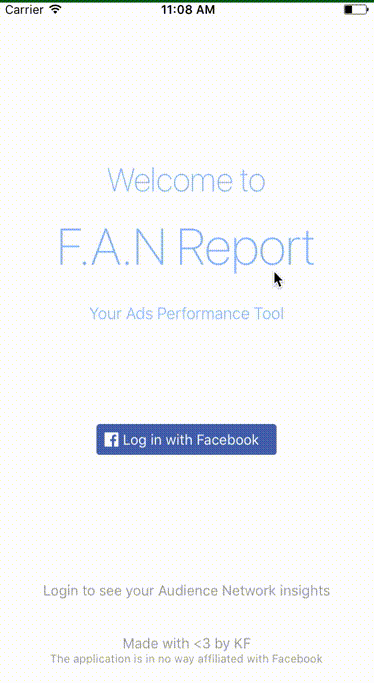

# Audience Network - Facebook Ads Performance Tool

 

Check your Facebook Audience Network performance quickly with the app. It shows number of ad requests, filled ad requests, impressions, clicks, 10 seconds video views and estimated revenue, charts and many more.

The application is built using the following products from [Facebook](https://developers.facebook.com/):

* [**Facebook Login**](https://developers.facebook.com/docs/facebook-login) - Facebook Login is a secure, fast and convenient way for people to log into your app or website.

* [**Graph API**](https://developers.facebook.com/docs/graph-api) - The primary way for apps to read and write to the Facebook social graph.
  * [Audience Network Reporting API](https://developers.facebook.com/docs/audience-network/reporting-api) (/**APP_ID**/app_insights/app_event/) - The Audience Network Reporting API lets you automate downloading performance data for your apps.

    * **Number of ad requests**: fb_ad_network_request | COUNT
    * **Number of filled ad requests**: fb_ad_network_request | SUM
    * **Number of impressions**: fb_ad_network_imp | COUNT
    * **Number of clicks**: fb_ad_network_click | COUNT
    * **Number of 10 seconds video views**: fb_ad_network_video_view | COUNT
    * **Estimated revenue**: fb_ad_network_revenue | SUM

* [**Facebook Audience Network**](https://developers.facebook.com/docs/marketing-api/audience-network) - With Facebook's Audience Network you can serve your ads on other publishers' iOS and Android apps and mobile websites. Then you can use all of Facebook's targeting options to find your audience within those mobile apps and mobile websites.

* [**Facebook Analytics for Apps**](https://developers.facebook.com/docs/analytics) - Understand and reach the people using your apps.

The application is build with [React Native](https://github.com/facebook/react-native) (available both iOS and Android).

## App Preview

## Download

## Screenshots

  

 

## React and React Native version

* [react](https://github.com/facebook/react): 16.0.0-alpha.6
* [react-native](https://github.com/facebook/react-native): 0.44.0

## Redux

* [react-redux](https://github.com/reactjs/react-redux) - Official React bindings for Redux.
* [redux-logger](https://github.com/evgenyrodionov/redux-logger) - Logger for Redux.
* [redux-thunk](https://github.com/gaearon/redux-thunk) - Thunk middleware for Redux.

## Plugins used

* [react-native-elements](https://github.com/react-native-community/react-native-elements) - React Native Elements UI Toolkit.
* [react-native-fbads](https://github.com/callstack-io/react-native-fbads) - Facebook Audience SDK integration for React Native.
* [react-native-fbsdk](https://github.com/facebook/react-native-fbsdk) - A React Native wrapper around the Facebook SDKs for Android and iOS. Provides access to Facebook login, sharing, graph requests, app events etc.
* [react-native-pathjs-charts](https://github.com/capitalone/react-native-pathjs-charts) - Android and iOS charts based on react-native-svg and paths-js.
* [react-native-safari-view](https://github.com/naoufal/react-native-safari-view) - A React Native wrapper for Safari View Controller.
* [react-native-simple-store](https://github.com/jasonmerino/react-native-simple-store) - A minimalistic wrapper around React Native's AsyncStorage.
* [react-native-svg](https://github.com/react-native-community/react-native-svg) - SVG library for React Native.
* [react-native-swipe-list-view](https://github.com/jemise111/react-native-swipe-list-view) - A React Native ListView component with rows that swipe open and closed.
* [react-native-tab-view](https://github.com/react-native-community/react-native-tab-view) - A cross-platform Tab View component for React Native.
* [react-navigation](https://github.com/react-community/react-navigation)
* [react-native-vector-icons](https://github.com/oblador/react-native-vector-icons) - 3000 Customizable Icons for React Native with support for NavBar/TabBar/ToolbarAndroid, image source and full stying.
* [rn-viewpager](https://github.com/zbtang/React-Native-ViewPager) - ViewPager and Indicator component for react-native on both android and ios.

## Additional

* [moment](https://github.com/moment/moment) - Parse, validate, manipulate, and display dates in javascript.

## Running

#### Clone & install

* Clone this repo `git clone git@github.com:7kfpun/AudienceNetworkReactNative.git`
* `cd AudienceNetworkReactNative`
* `cp app/config.example.js app/config.js`  // and config it
* run `npm install` || run `yarn install`

#### iOS

* Run `react-native run-ios`

#### Android

* Run `android avd` and start an emulator
* Run `react-native run-android`

## License

Released under the [MIT License](http://opensource.org/licenses/MIT).
